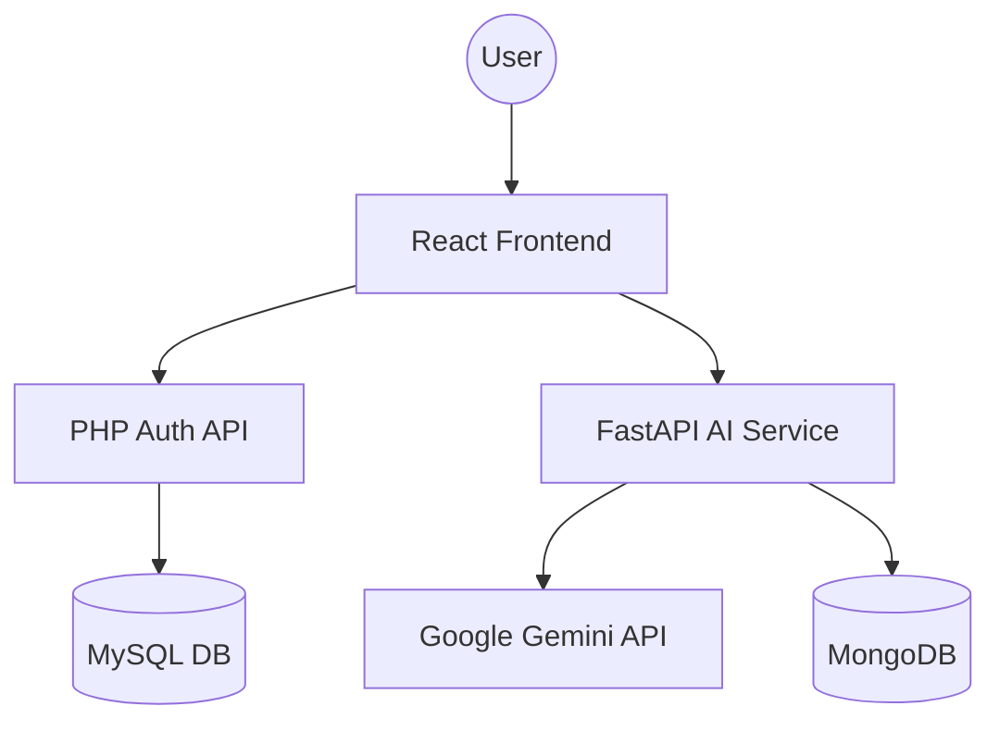

# AI TRIP PLANNER: PROJECT REPORT
## A SMART, AI-POWERED TRAVEL COMPANION

**Submitted by:** [Your Name]  
**Roll No:** [Your Roll Number]  
**Branch:** [Your Branch]  
**College:** [Your College Name]

---

## TABLE OF CONTENTS
1. [Abstract](#1-abstract)
2. [Introduction](#2-introduction)
3. [Objectives](#3-objectives)
4. [Technology Stack](#4-technology-stack)
5. [System Architecture](#5-system-architecture)
6. [Key Features](#6-key-features)
7. [Implementation Details](#7-implementation-details)
8. [Visual Documentation & Screenshots](#8-visual-documentation--screenshots)
9. [Conclusion](#9-conclusion)
10. [Future Scope](#10-future-scope)

---

## 1. ABSTRACT
The **AI Trip Planner** is a state-of-the-art web application designed to simplify the complex process of travel planning. By leveraging the **Google Gemini AI API**, the application generates highly personalized, day-by-day itineraries based on user-defined preferences such as destination, duration, budget, and travel style. The project emphasizes a premium user experience with cinematic visuals, glassmorphism design, and a robust microservices architecture.

## 2. INTRODUCTION
Travel planning often involves navigating through multiple platforms to find activities, accommodation, and transport. This project aims to centralize that experience. By providing an AI-driven interface, users can skip hours of research and receive a practical, structured travel plan in seconds. The application focus on the Indian market, providing costs in INR (₹) and integrating local travel insights.

## 3. OBJECTIVES
- **Personalization**: Automate the creation of unique itineraries tailored to specific user needs.
- **Modern UI/UX**: Deliver a "premium" feel using 3D graphics and smooth animations.
- **Full-Stack Integration**: Combine multiple technologies (React, FastAPI, PHP, MySQL, MongoDB) into a seamless ecosystem.
- **Actionable Data**: Provide realistic cost estimates and specific recommendations for hotels and local spots.

## 4. TECHNOLOGY STACK
The project follows a modern, distributed architecture:

| Component | Technology | Role |
| :--- | :--- | :--- |
| **Frontend** | React.js (Vite) | Dynamic UI, State Management |
| **Animations** | Framer Motion | Smooth Transitions & Micro-interactions |
| **3D Graphics** | Three.js / R3F | Immersive 3D Backgrounds |
| **AI Service** | FastAPI (Python) | AI Logic & Gemini API Integration |
| **Auth Service** | PHP | Secure User Authentication |
| **Relational DB**| MySQL | User Profiles & Account Data |
| **NoSQL DB** | MongoDB | Saved Trip Itineraries |

## 5. SYSTEM ARCHITECTURE
The application uses a microservices approach to separate concerns:

## 6. KEY FEATURES
- **AI-Powered Generation**: Real-time itinerary creation using Generative AI.
- **Cinematic 3D UI**: Interactive rotating Earth and parallax effects for a luxury feel.
- **Multi-Cloud Database**: Secure storage of user data in MySQL and flexible JSON trip data in MongoDB.
- **Cost Analysis**: Automated calculation of travel expenses in Indian Rupees (INR).
- **Secure Sessions**: Full login/signup flow with password hashing and session management.

## 7. IMPLEMENTATION DETAILS

### Frontend Components
- **`Home.jsx`**: Features the main input form with glassmorphism styling.
- **`Results.jsx`**: A dynamic dashboard that parses and renders AI-generated JSON.
- **`Background3D.jsx`**: Manages the WebGL environment for immersive visuals.

### Backend Services
- **FastAPI**: Acts as a bridge between the frontend and Google Gemini. It handles prompt engineering to ensure consistent JSON outputs.
- **PHP Scripts**: Handle SQL queries for registration and login, ensuring secure data persistence.

---

## 8. VISUAL DOCUMENTATION & SCREENSHOTS

### 8.1 Landing Page & Trip Planner
The entry point of the application features an immersive 3D Earth background. The central glassmorphism form allows users to define their travel parameters seamlessly.

### 8.2 AI-Generated Itinerary
The results page presents a curated, day-by-day plan with time-slotted activities, luxury hotel recommendations, and transport options.

### 8.3 User Authentication Interface
A secure and animated interface for user registration and login, ensuring that every traveler has a personalized experience.

### 8.4 Saved Trips Dashboard
Users can revisit their previous journeys in a premium card-based layout, allowing for easy management of their travel history.

---

## 9. CONCLUSION
The AI Trip Planner successfully integrates advanced Generative AI with a modern full-stack architecture. By prioritizing both technical robustness and visual excellence, the project provides a scalable and user-friendly solution to the challenges of modern travel planning.

## 10. FUTURE SCOPE
- **Real-time API Integration**: Connecting with Amadeus or Skyscanner for live booking.
- **PDF Export**: Allowing users to download their itineraries as high-quality PDF documents.
- **Community Features**: Shared itineraries and user reviews for specific trip plans.

---
**Date:** May 15, 2026  
**Project Lead:** [Your Name]
