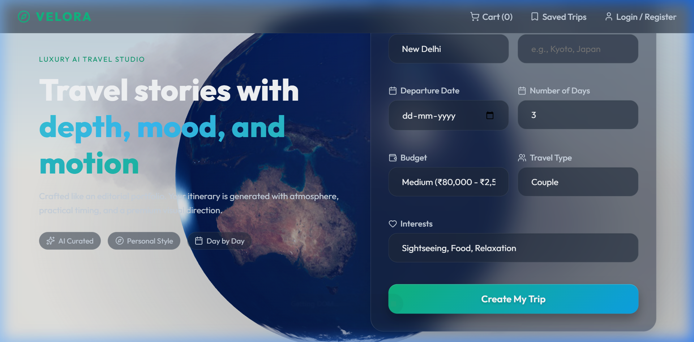
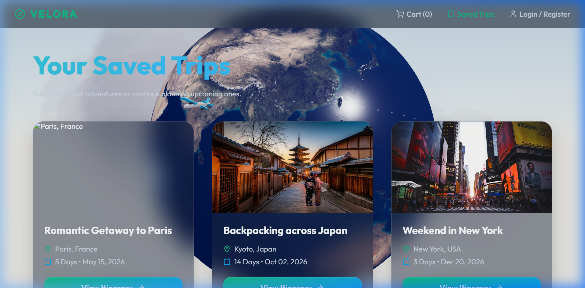

# AI Trip Planner - Comprehensive Project Report

**Project Title:** AI-Powered Personalized Trip Planner  
**Architecture:** Full-Stack (React + FastAPI + PHP/MySQL)  
**AI Integration:** Google Gemini Generative AI  


## 1. Introduction
The **AI Trip Planner** is a state-of-the-art web application designed to simplify travel planning. By leveraging Artificial Intelligence, the platform generates tailored itineraries based on user preferences such as destination, budget, travel style, and specific interests. The application focuses on a premium user experience with cinematic visuals and realistic, actionable travel data.

## 2. Core Features
- **AI Itinerary Generation:** Real-time generation of day-wise plans using Google Gemini.
- **Dynamic 3D UI:** An immersive landing page featuring a Three.js-powered 3D background.
- **Dual-Backend System:** Python FastAPI for high-performance AI processing and PHP for secure user authentication.
- **Localized Content:** Focus on Indian travelers with INR (₹) pricing and local booking platforms (IRCTC, Uber, MakeMyTrip).
- **Responsive Design:** Seamless experience across mobile, tablet, and desktop devices.
- **User Management:** Secure signup/login system to save and manage trips.

---

## 3. Technology Stack

### Frontend
- **React.js:** Component-based UI development.
- **Vite:** High-speed build tool and development server.
- **Framer Motion:** Smooth UI animations and transitions.
- **React Three Fiber:** Integration of 3D graphics into the React ecosystem.
- **Lucide React:** Modern vector icons.

### Backend (AI Services)
- **FastAPI (Python):** Modern, fast web framework for building APIs.
- **Google Generative AI:** Powers the core intelligence of the trip planner.
- **Pydantic:** Data validation and settings management.

### Backend (User Authentication)
- **PHP:** Server-side scripting for database interactions.
- **MySQL:** Relational database for storing user credentials.
- **XAMPP/Apache:** Local server environment.

---

## 4. System Architecture & Workflow

### Workflow Steps:
1. **User Interaction:** User submits a trip request via the React frontend.
2. **AI Processing:** The frontend communicates with the FastAPI server, which constructs a complex prompt for the Gemini AI.
3. **Data Generation:** Gemini returns a structured JSON object containing the itinerary, hotels, and costs.
4. **UI Rendering:** React parses the JSON and renders a dynamic, interactive dashboard.
5. **Persistence:** Users can register via the PHP backend to save their generated trips to the MySQL database.

---

## 5. Detailed File Explanations

### Frontend Components
- **`App.jsx`**: Handles global state and client-side routing.
- **`Home.jsx`**: The entry point featuring the AI planner form.
- **`Results.jsx`**: Displays the AI-generated content in a structured grid.
- **`Background3D.jsx`**: Managed the WebGL 3D environment.

### Backend Services
- **`ai_service.py`**: Contains the logic for prompt engineering and AI communication.
- **`main.py`**: The API gateway for the Python services.
- **`register.php` / `login.php`**: Secure scripts for user account management.

---

## 6. Database Design (MySQL)
The system uses a relational database to manage users.

**Table: `users`**
| Column | Type | Description |
| :--- | :--- | :--- |
| `id` | INT (PK) | Unique user identifier (Auto-increment). |
| `name` | VARCHAR | Full name of the user. |
| `email` | VARCHAR | Unique email address. |
| `password_hash` | VARCHAR | Securely hashed password. |
| `created_at` | TIMESTAMP | Account creation date. |

---

## 7. Core Logic Implementation

### AI Prompt Engineering (`ai_service.py`)
The system uses a specific instruction set to ensure the AI returns data in a usable format:
```python
prompt = f"""
You are an expert AI Travel Planner. Create a detailed {days}-day itinerary for {destination}.
Output MUST be strictly JSON.
Include: 
- Day-wise activities with costs in INR.
- Hotel suggestions with ratings.
- Transport options (Flight, Train, Local).
- Food recommendations (Famous spots and traditional dishes).
"""
```

### Authentication Logic (`register.php`)
Ensures security by hashing passwords before storage:
```php
$hashed_password = password_hash($password, PASSWORD_DEFAULT);
$insert_query = "INSERT INTO users (name, email, password_hash) VALUES ('$name', '$email', '$hashed_password')";
```

---

## 8. Installation & Setup
1. **Frontend:**
   - Navigate to `/frontend`
   - Run `npm install` followed by `npm run dev`
2. **Python Backend:**
   - Navigate to `/backend`
   - Install requirements: `pip install -r requirements.txt`
   - Run: `uvicorn main:app --reload`
3. **PHP Backend:**
   - Move `/php_backend` to your XAMPP `htdocs` folder.
   - Import `setup.sql` into phpMyAdmin.

---

## 9. Visual Documentation

### 9.1 Landing Page & Trip Planner
The main interface of the application, featuring an immersive 3D rotating Earth background powered by Three.js. The central form uses a glassmorphism design where users can input their destination, travel duration, budget level (Economy, Mid-range, Luxury), and travel companion type.


### 9.2 Generated Itinerary & Results
The dashboard showing the AI-generated results. It presents a comprehensive travel plan including daily schedules, estimated costs in INR, and interactive cards for recommended hotels and transport options. The layout is designed with a floating panel aesthetic for better readability and a premium feel.


### 9.3 User Authentication Interface
The secure login and registration system. This interface features smooth Framer Motion transitions between login and signup modes. It connects to the PHP/MySQL backend to securely manage user sessions and account creation, ensuring user data privacy.


### 9.4 Saved Trips Dashboard
A personalized space for users to revisit their previously generated itineraries. Each trip is displayed as a premium card with location images and summary details, allowing users to quickly access their travel plans and manage their travel history effectively.

    
## 10. Conclusion
The AI Trip Planner demonstrates the powerful integration of Generative AI with modern web technologies. It provides a scalable solution for personalized travel planning, offering a glimpse into the future of automated concierge services.
