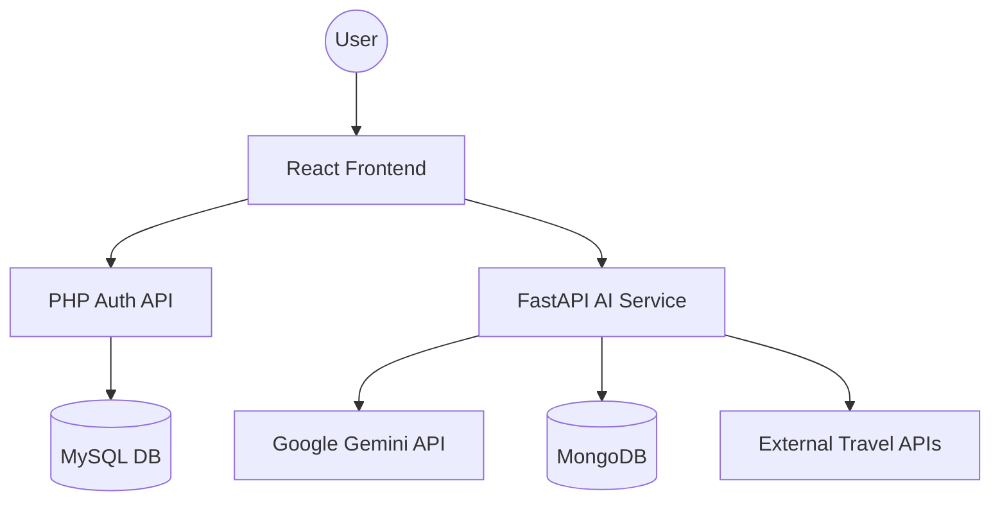

# PROJECT REPORT
# AI TRIP PLANNER: A SMART TRAVEL COMPANION

**Submitted by:** [Your Name]  
**Roll No:** [Your Roll Number]  
**Class:** [Your Class/Semester]  
**Department:** [Your Department]  
**College:** [Your College Name]

---

## 1. ABSTRACT
The **AI Trip Planner** is a state-of-the-art web application designed to simplify the process of travel planning. By leveraging the power of Artificial Intelligence (Google Gemini API), the application generates personalized, day-by-day itineraries based on user preferences such as destination, budget, travel type, and interests. The project features a premium glassmorphism UI, a secure authentication system, and a robust microservices-based architecture combining React, FastAPI, PHP, MySQL, and MongoDB.

## 2. INTRODUCTION
Planning a trip often involves hours of research on multiple websites to find the best places to visit, stay, and eat. The AI Trip Planner solves this by providing a unified platform where a user can generate a complete travel plan in seconds. It uses AI to ensure the timing and flow of the itinerary are practical and enjoyable, moving away from static, pre-defined tour packages.

## 3. OBJECTIVES
- To automate the creation of personalized travel itineraries.
- To provide a premium and immersive user experience using modern web technologies.
- To integrate multiple backend technologies (PHP & Python) to handle different concerns like Authentication and AI Processing.
- To offer real-time hotel and transport suggestions integrated into the trip flow.

## 4. TECHNOLOGY STACK
The project follows a modern full-stack architecture:

### Frontend
- **React.js**: For building a dynamic and responsive user interface.
- **Vite**: As the build tool for faster development.
- **Framer Motion**: For smooth animations and transitions.
- **Lucide React**: For a modern, consistent icon set.
- **Vanilla CSS**: Custom styling with glassmorphism effects and 3D backgrounds.

### Backend (Microservices)
- **FastAPI (Python)**: Handles the AI logic, itinerary generation, and Gemini API integration.
- **PHP**: Manages user authentication (Registration and Login) for secure access.

### Database
- **MySQL**: Stores user credentials and profile information.
- **MongoDB**: Stores generated trip data and user-saved itineraries.

### External APIs
- **Google Gemini API**: The core AI engine used for generating structured travel plans.

## 5. SYSTEM ARCHITECTURE
The system is divided into three primary layers:

1.  **Presentation Layer**: The React frontend where users interact with the planner.
2.  **Logic Layer**:
    -   **Auth Service**: PHP scripts handling login/signup requests.
    -   **AI Service**: FastAPI endpoints that process user input and communicate with Gemini API.
3.  **Data Layer**:
    -   **Relational DB (MySQL)**: For structured user data.
    -   **NoSQL DB (MongoDB)**: For flexible trip document storage.

## 6. DATABASE SCHEMA

### Relational Database (MySQL)
**Database Name:** `trip_planner`
**Table:** `users`
- `id`: INT (Primary Key, Auto-increment)
- `name`: VARCHAR(255)
- `email`: VARCHAR(255) (Unique)
- `password_hash`: VARCHAR(255)
- `created_at`: TIMESTAMP

### NoSQL Database (MongoDB)
**Database Name:** `trip_planner`
**Collection:** `trips`
- `user_id`: String (Reference to user)
- `trip_data`: Object (The full JSON itinerary)
- `created_at`: Date

## 7. KEY FEATURES
- **AI-Powered Itinerary Generation**: Users provide basic details (Destination, Days, Budget, Type), and the AI returns a detailed plan.
- **Premium 3D UI**: Interactive 3D backgrounds and glassmorphism design for a luxury feel using `react-parallax-tilt`.
- **Integrated Shopping Cart**: Users can select recommended hotels and transport options and add them to a checkout flow.
- **Secure Authentication**: Multi-step registration and login process handled via PHP/MySQL.
- **Micro-Animations**: Smooth transitions using `framer-motion` for a premium user experience.
- **Responsive Design**: Optimized for both Desktop and Mobile devices.

## 8. IMPLEMENTATION DETAILS

### Frontend Components
- `Home.jsx`: The entry point with the main planner form featuring 3D tilt effects.
- `Results.jsx`: Displays the generated itinerary, hotel suggestions, and transport options in floating glass panels.
- `Auth.jsx`: Handles user authentication with animated form toggling.
- `Background3D.jsx`: Uses Three.js/WebGL for immersive visual effects.
- `Navbar.jsx`: Blur-filtered navigation for seamless page transitions.

### Backend API (FastAPI)
- **Endpoint**: `/api/generate-trip` (POST)
- **Core Logic**:
    1.  Receives user preferences.
    2.  Prompts Google Gemini API with a structured prompt.
    3.  Parses the AI response into a valid JSON format.
    4.  Returns the data to the frontend for rendering.

### Backend API (PHP)
- **`register.php`**: Validates input and hashes passwords before storing in MySQL.
- **`login.php`**: Verifies user credentials and starts a session.

## 9. RESULTS AND SCREENSHOTS

### 9.1 Landing Page & Trip Planner
The main interface of the application, featuring an immersive 3D rotating Earth background powered by Three.js. The central form uses a glassmorphism design where users can input their destination, travel duration, budget level (Economy, Mid-range, Luxury), and travel companion type.

### 9.2 Generated Itinerary & Results
The dashboard showing the AI-generated results. It presents a comprehensive travel plan including daily schedules, estimated costs in INR, and interactive cards for recommended hotels and transport options. The layout is designed with a floating panel aesthetic for better readability and a premium feel.

### 9.3 Secure Authentication Interface
The secure login and registration system. This interface features smooth Framer Motion transitions between login and signup modes. It connects to the PHP/MySQL backend to securely manage user sessions and account creation, ensuring user data privacy.

### 9.4 Saved Trips Dashboard
A personalized space for users to revisit their previously generated itineraries. Each trip is displayed as a premium card with location images and summary details, allowing users to quickly access their travel plans and manage their travel history effectively.

## 10. CONCLUSION
The AI Trip Planner successfully demonstrates the integration of modern AI models with a full-stack web application. It provides a seamless user experience, from authentication to final trip generation, solving a common problem for travelers with efficiency and style.

## 11. FUTURE SCOPE
- **Real-time Booking**: Integrating actual hotel and flight booking APIs (e.g., Amadeus, Skyscanner).
- **Collaborative Planning**: Allowing multiple users to edit a single trip itinerary.
- **Offline Access**: Providing a downloadable PDF version of the itinerary.
- **Expense Tracker**: A built-in module to track actual spending during the trip.

---
**Date:** May 14, 2026  
**Signature:** ____________________
